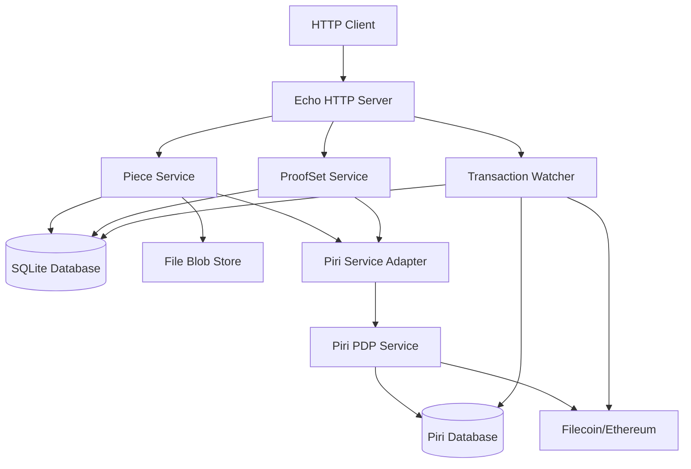

# PDP Server Architecture

## Overview

The PDP Server is a standalone HTTP service that provides Proof of Data Possession (PDP) capabilities for Filecoin and Ethereum networks. It integrates with the [Piri](https://github.com/storacha/piri) library as an external dependency to handle blockchain interactions while maintaining its own isolated database for operational state.

## System Architecture



## Core Components

### 1. HTTP API Layer (`pkg/api`)
- **Framework**: Echo v4 web framework
- **Purpose**: RESTful API endpoints for client interactions
- **Features**:
  - Health checks and status endpoints
  - File upload and piece management
  - Proof set creation and management
  - Transaction monitoring

### 2. Piece Service (`pkg/piece`)
- **Purpose**: Manages data pieces for Filecoin storage
- **Key Features**:
  - Power-of-2 padding for Filecoin compatibility
  - CommP (Piece Commitment) calculation
  - Blob storage integration
  - Piece metadata management

### 3. Proof Set Service (`pkg/proofset`)
- **Purpose**: Manages proof sets and their lifecycle
- **Integration**: Works with Piri's proof set service
- **Features**:
  - Proof set creation on blockchain
  - Root addition to proof sets
  - Status tracking and updates

### 4. Transaction Watcher (`pkg/watcher`)
- **Purpose**: Monitors blockchain transactions for confirmation
- **Architecture**: Background service with periodic polling
- **Integration**: Bridges Piri's transaction database with local state

### 5. Service Adapter (`pkg/service`)
- **Purpose**: Abstracts Piri service integration
- **Pattern**: Adapter pattern for clean separation
- **Benefits**: Isolates external dependency, enables testing

### 6. Blob Store (`pkg/blobstore`)
- **Implementation**: File system-based storage
- **Purpose**: Persistent storage for uploaded data
- **Interface**: Generic blob store interface for future extensibility

## Data Architecture

### Database Design

The system uses a dual-database architecture:

1. **Local SQLite Database**
   - Operational state and metadata
   - Piece information and status
   - Proof set tracking
   - Transaction status cache

2. **Piri Database** (External)
   - Blockchain transaction records
   - Piri-specific state management
   - Wallet and key management

### Data Models

```go
// Core data models
type PieceInfo struct {
    ID          uint      `gorm:"primaryKey"`
    PieceCID    string    `gorm:"uniqueIndex"`
    Size        int64
    Status      string
    CreatedAt   time.Time
}

type PDPProofSet struct {
    ID            uint      `gorm:"primaryKey"`
    ProofSetID    string    `gorm:"uniqueIndex"`
    Status        string
    TransactionID string
    CreatedAt     time.Time
}
```

## Integration Patterns

### Piri Integration
- **External Package**: Uses Piri as Go module dependency
- **Service Boundaries**: Clear separation between PDP server and Piri
- **State Synchronization**: Transaction watcher keeps databases in sync

### Blockchain Integration
- **Filecoin**: Via Lotus node connection
- **Ethereum**: Via Ethereum client
- **Wallets**: Reuses existing Piri wallet infrastructure

## Configuration Management

### Configuration Sources
1. YAML configuration file (`config.yaml`)
2. Environment variables (optional)
3. Command-line flags (future)

### Key Configuration Areas
- Server settings (host, port)
- Database connections
- Blockchain endpoints
- Storage paths
- Piri integration settings

## Security Considerations

### Data Security
- Private keys stored in secure PEM files
- Database access restricted to application
- File system permissions properly configured

### Network Security
- HTTP endpoints with proper validation
- Rate limiting capabilities (configurable)
- CORS handling for web clients

### Operational Security
- Structured logging for audit trails
- Health checks for monitoring
- Graceful shutdown handling

## Scalability Design

### Horizontal Scaling
- Stateless HTTP handlers
- External database for shared state
- Load balancer compatible

### Vertical Scaling
- Efficient memory usage
- Connection pooling
- Configurable worker threads

### Storage Scaling
- Pluggable blob store interface
- Support for cloud storage backends
- Configurable storage paths

## Monitoring and Observability

### Health Checks
- `/health` endpoint for basic health
- `/status` endpoint for detailed status
- Database connectivity checks

### Logging
- Structured logging with levels
- Request/response logging
- Error tracking and reporting

### Metrics (Future)
- Prometheus-compatible metrics
- Performance monitoring
- Business metrics tracking

## Development Patterns

### Code Organization
- Clean architecture principles
- Dependency injection
- Interface-based design
- Separation of concerns

### Error Handling
- Structured error types
- Proper error propagation
- Client-friendly error messages
- Logging for debugging

### Testing Strategy
- Unit tests for business logic
- Integration tests for API endpoints
- End-to-end test scripts
- Mock services for external dependencies

## Deployment Architecture

### Single Node Deployment
```
[Load Balancer] -> [PDP Server] -> [SQLite DB]
                       |
                   [File Storage]
                       |
                [Piri Integration] -> [Blockchain Networks]
```

### Multi-Node Deployment (Future)
```
[Load Balancer] -> [PDP Server 1] -> [Shared Database]
                -> [PDP Server 2] -> [Shared Storage]
                -> [PDP Server N]
```

## Technology Stack

### Core Technologies
- **Language**: Go 1.21+
- **Web Framework**: Echo v4
- **Database**: SQLite (GORM ORM)
- **Configuration**: Viper
- **Blockchain**: Piri integration

### External Dependencies
- **Piri**: Core PDP functionality
- **Ethereum**: go-ethereum client
- **Filecoin**: Lotus node integration
- **Storage**: File system blob store

## Future Enhancements

### Planned Features
1. **Advanced Monitoring**: Prometheus metrics, distributed tracing
2. **Authentication**: JWT-based authentication system
3. **Rate Limiting**: Per-client rate limiting
4. **Cloud Storage**: S3-compatible blob store
5. **High Availability**: Multi-node deployment support

### Architectural Evolution
1. **Microservices**: Split into focused microservices
2. **Event Sourcing**: Event-driven architecture
3. **CQRS**: Command Query Responsibility Segregation
4. **Message Queues**: Async processing with queues
